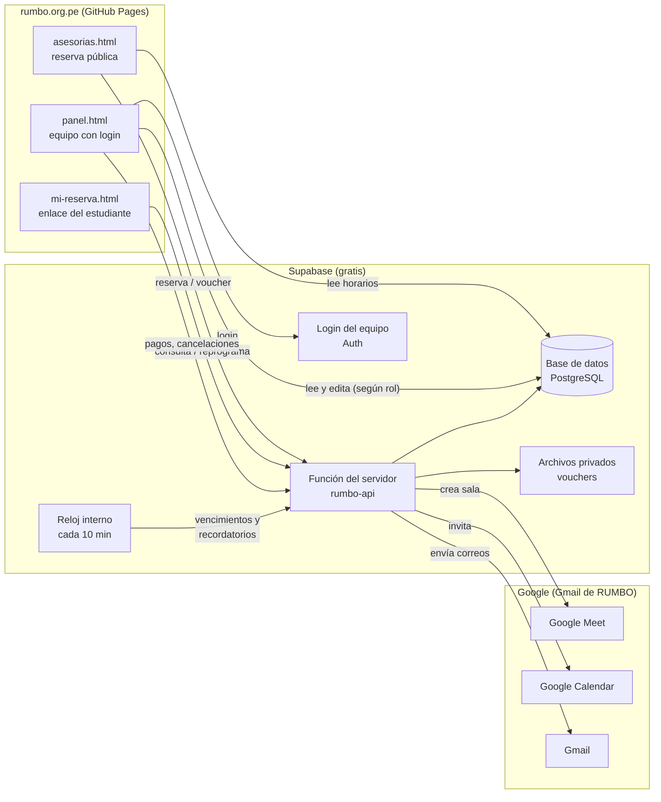
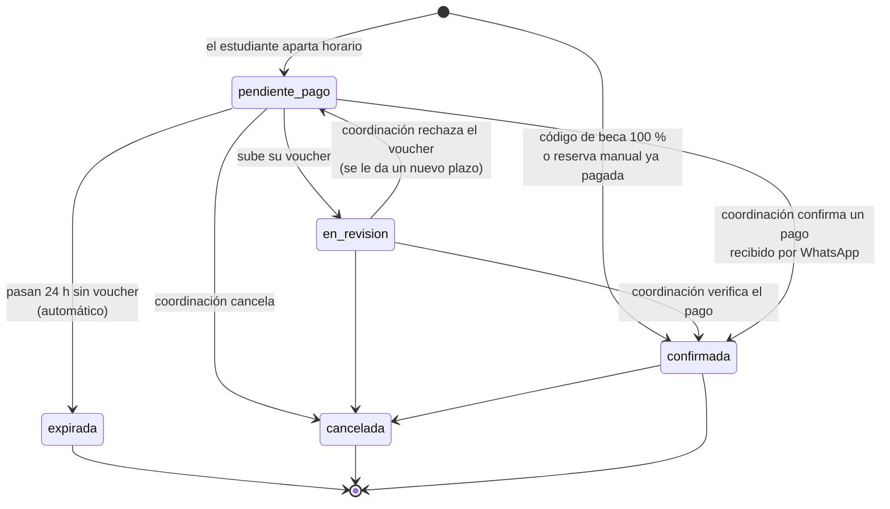
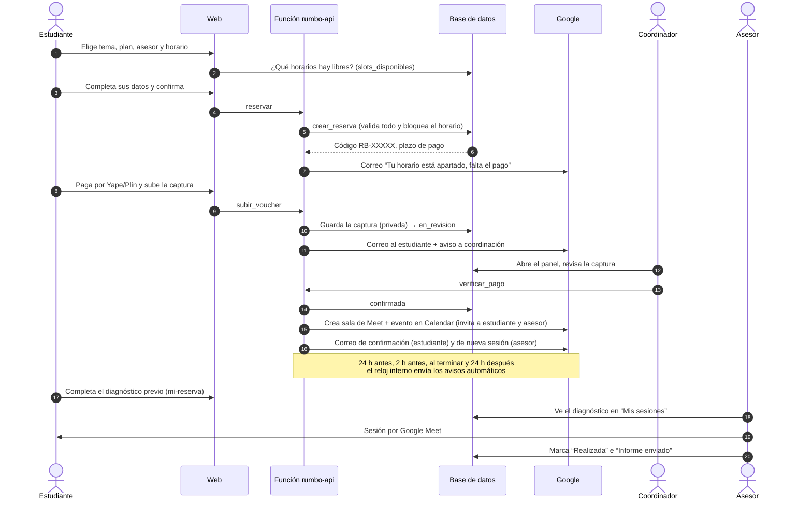
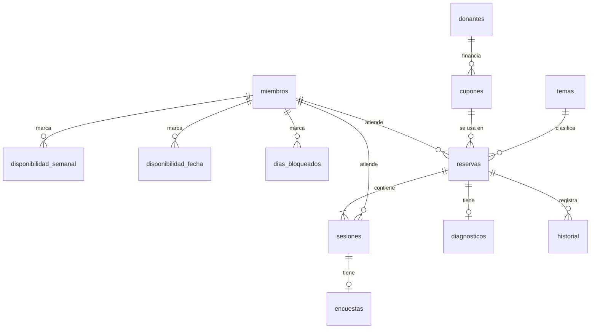

# Sistema de reservas de asesorías RUMBO: cómo funciona

Este documento explica **cómo funciona por dentro** el sistema de reservas: qué piezas tiene, dónde se guarda cada dato, qué reglas cumple y qué pasa en cada momento de una reserva. Para instalarlo, sigue la [guía paso a paso](02-guia-paso-a-paso.md). Para usarlo día a día, lee el [manual del equipo](03-manual-del-equipo.md).

---

## 1. Resumen en una frase

La web (GitHub Pages) muestra los horarios libres que cada asesor marca en un **panel privado**. El estudiante aparta un horario y paga por Yape o Plin. Un coordinador verifica el pago y el sistema **crea solo el Google Meet, envía las invitaciones y los recordatorios**. Todo se guarda en una base de datos **Supabase** gratuita.

## 2. Las piezas



| Pieza | Qué es | Dónde vive | Costo |
|---|---|---|---|
| Páginas web | `asesorias.html`, `mi-reserva.html`, `panel.html`, `privacidad.html` | Tu repositorio en GitHub Pages | S/ 0 |
| Base de datos | PostgreSQL con 14 tablas, reglas y permisos por rol | Supabase (plan Free) | S/ 0 |
| Función del servidor `rumbo-api` | Lógica que no puede vivir en el navegador: crear reservas, recibir vouchers, Meet, correos | Supabase Edge Functions | S/ 0 |
| Login del equipo | Correo + contraseña | Supabase Auth | S/ 0 |
| Archivos | Capturas de pago (privadas) | Supabase Storage, bucket `vouchers` | S/ 0 |
| Reloj interno | Ejecuta tareas cada 10 minutos | Supabase Cron (`pg_cron`) | S/ 0 |
| Google | Meet, Calendar y Gmail con la cuenta de RUMBO | Google Cloud (proyecto gratuito) | S/ 0 |
| Respaldo "despertador" | Consulta mínima cada 2 días para que Supabase no se pause | GitHub Actions | S/ 0 |

### Archivos del repositorio

```
asesorias.html            ← página pública de reserva (5 pasos + pago)
mi-reserva.html           ← página personal del estudiante (enlace secreto, o código + correo)
panel.html                ← panel del equipo (login)
privacidad.html           ← política de privacidad (Ley 29733)
css/asesorias.css         ← estilos de las páginas públicas
css/panel.css             ← estilos del panel
js/rumbo-config.js        ← ★ ÚNICO archivo que se edita para conectar Supabase
js/rumbo-comun.js         ← utilidades compartidas (fechas en hora de Lima, llamadas, modo demo)
js/asesorias.js           ← lógica de la reserva
js/mi-reserva.js          ← lógica de “Mi reserva” (incluye las preguntas del diagnóstico)
js/panel.js               ← lógica del panel
supabase/sql/01_estructura.sql        ← tablas, reglas, funciones y seguridad
supabase/sql/02_datos_iniciales.sql   ← temas, los 8 asesores y el código AMIGOS
supabase/sql/03_automatizaciones.sql  ← tarea automática cada 10 minutos
supabase/functions/rumbo-api/index.ts ← función del servidor (un solo archivo)
.github/workflows/supabase-activo.yml ← despertador cada 2 días
docs/asesorias/                       ← esta documentación
```

---

## 3. Recorrido de una reserva

### 3.1 Estados

Cada **reserva** (lo que compra el estudiante: 1 sesión o un pack de 3) pasa por estos estados:



Cada **sesión** (cada encuentro de 60 min) tiene su propio estado: `activa` → `realizada` o `no_asistio`, o `cancelada` si se cancela la reserva.

### 3.2 Paso a paso (sesión individual pagada)



### 3.3 Variantes

| Caso | Qué cambia |
|---|---|
| **Pack de 3 sesiones** | El estudiante elige 3 horarios **en días distintos** con el mismo asesor. Se crean 3 sesiones y 3 eventos de Meet. Las 3 cuentan para el cupo del mes en que caen. |
| **“RUMBO elige”** | La web muestra los horarios de todos los asesores especialistas en el tema (si nadie tiene ese tema, de todo el equipo). Al reservar, el sistema asigna al que tiene **menos sesiones en el mes** entre quienes están libres en todos los horarios elegidos. |
| **Beca 100 % (Modalidad B)** | El estudiante escribe un código `BECA-XXXX-XXXX`. La reserva nace **confirmada**, sin pago, con modalidad B, y queda ligada al donante del código. |
| **Reserva por WhatsApp** | Coordinación la registra en el panel (“Reserva manual”). Puede confirmarla al instante si ya pagó, y “forzar” un horario acordado fuera de la disponibilidad publicada. |
| **Menor de edad** | Se exigen nombre, contacto y autorización del apoderado. Si deja su correo, recibe copia de la confirmación, de los recordatorios y de la invitación de Calendar. |

---

## 4. Disponibilidad: cómo la guarda cada asesor

La disponibilidad se arma en **tres capas**, todas editables desde **Panel → Disponibilidad** con un toque:

1. **Horario fijo semanal** (`disponibilidad_semanal`): por ejemplo, martes y jueves a las 19:00 y 20:00. Se repite todas las semanas.
2. **Cambios para una fecha** (`disponibilidad_fecha`):
   - **bloqueo**: “este martes 14 a las 19:00 no puedo” (solo esa fecha);
   - **extra**: “este sábado 18 puedo además a las 10:00”.
3. **Días completos bloqueados** (`dias_bloqueados`): viajes, exámenes, vacaciones (se pueden bloquear rangos de fechas).

Cada bloque es una sesión de **60 minutos que empieza en punto** (hora de Lima).

### Cómo se calculan los horarios libres

La función `slots_disponibles` hace este cálculo cada vez que alguien abre el calendario:

```
horarios posibles = horario semanal (para cada fecha)
                  + extras de esa fecha
                  − bloqueos de esa fecha
                  − días bloqueados
                  − horarios que ya tienen una sesión (apartada, por verificar o confirmada)
                  − meses en que el asesor ya llenó su cupo
                  − lo que empieza antes de 48 h desde ahora
                  − lo que empieza después de 30 días desde ahora
```

Por eso, **no hay que “actualizar la web”**: lo que el asesor marca en el panel aparece al instante.

---

## 5. Reglas que garantiza el sistema

| Regla | Valor inicial | Dónde se cambia | Cómo se garantiza |
|---|---|---|---|
| Nadie puede tener dos sesiones que se crucen | — | — | **Restricción de exclusión** en la base de datos (`sesiones_sin_choques`): aunque dos personas reserven el mismo horario en el mismo milisegundo, la segunda recibe “ese horario acaba de ser tomado”. Además, cada reserva **bloquea la fila del asesor** mientras se valida, para que el cupo no se pase. *Probado con dos reservas simultáneas.* |
| Duración del bloque | 60 min | Ajustes | Los bloques empiezan cada hora. |
| Anticipación mínima | 48 h | Ajustes | `slots_disponibles` y `crear_reserva`. |
| Ventana máxima | 30 días | Ajustes | Ídem. |
| Plazo para subir el pago | 24 h | Ajustes | Si no llega, la tarea automática vence la reserva, libera el horario y devuelve el uso del código. El plazo nunca pasa de 6 h antes de la sesión. |
| Cupo mensual por asesor | 2 (Mes 1) | Equipo → editar | Se cuenta por mes calendario (hora de Lima). Vacío = sin límite. |
| Reprogramación por el estudiante | 1 vez por sesión, hasta 24 h antes | Ajustes | `reprogramar_sesion`. Coordinación puede mover sin límite. |
| Pack | 3 sesiones en días distintos | — | `crear_reserva` y `reprogramar_sesion`. |
| Límite anti-abuso | máx. 2 reservas pendientes de pago por correo | — | `crear_reserva`. También hay un campo trampa invisible para bots. |
| Debe existir al menos un administrador | — | — | Disparador `miembros_un_admin`. |

---

## 6. Base de datos



| Tabla | Para qué sirve |
|---|---|
| `ajustes` | Una sola fila con precios, reglas, datos de pago y contacto. |
| `temas` | Becas, CV, vocacional, universidad, entrevistas, bienestar, habilidades, otro. |
| `miembros` | Los integrantes: perfil público, temas, cupo y **roles** (`es_asesor`, `es_coordinador`, `es_admin`), y su cuenta de acceso. |
| `disponibilidad_semanal`, `disponibilidad_fecha`, `dias_bloqueados` | Las tres capas de disponibilidad. |
| `reservas` | Datos del estudiante (y del apoderado), plan, precio, descuento, código usado, estado del pago y voucher. Tiene un **token secreto** para el enlace “Mi reserva”. |
| `sesiones` | Cada encuentro: inicio, fin, estado, link de Meet, evento de Calendar, reprogramaciones y marcas de los avisos enviados. |
| `cupones` | Códigos `porcentaje`, `monto`, `beca`, `amigos` y `referido`, con usos, vencimiento y donante. |
| `donantes` | Quién financia las becas. |
| `diagnosticos` | Respuestas del diagnóstico previo. |
| `encuestas` | Calificación, NPS, comentarios y testimonio (con o sin autorización para publicar). |
| `historial` | Quién hizo qué y cuándo con cada reserva. |
| `notificaciones` | Registro de cada correo e invitación (enviado o con error). Se limpia solo después de 180 días. |

### Funciones principales (en la base de datos)

| Función | Quién la usa | Qué hace |
|---|---|---|
| `slots_disponibles` | Web pública | Calcula los horarios libres (sección 4). |
| `asesores_publicos`, `ajustes_publicos`, `validar_cupon` | Web pública | Datos sin información personal. |
| `crear_reserva` | Función del servidor | Valida datos, horario, cupo y código; elige asesor si es “RUMBO elige”; crea reserva + sesiones en una sola operación. |
| `confirmar_reserva`, `rechazar_pago`, `cancelar_reserva`, `reasignar_reserva` | Función del servidor (coordinación) | Ciclo de vida. |
| `registrar_voucher`, `reprogramar_sesion` | Función del servidor | Acciones del estudiante y de coordinación. |
| `expirar_reservas`, `reclamar_envios` | Tarea automática | Vencimientos y avisos (cada aviso se “reclama” antes de enviarse, así nunca sale dos veces). |
| `reserva_por_token`, `guardar_diagnostico`, `guardar_encuesta` | Página “Mi reserva” | Solo con el enlace secreto. |
| `buscar_reserva` | Página “Mi reserva” (sin enlace) | Devuelve el enlace secreto solo si el **código y el correo** coinciden con la misma reserva. Responde con una pequeña pausa para frenar intentos al azar. |
| `marcar_sesion`, `resumen_panel` | Panel | Marcar realizada / informe enviado; números del mes. |

---

## 7. Roles y permisos

Cada integrante puede tener **uno o varios roles**. Solo un **administrador** asigna roles.

| Puede… | Asesor | Coordinador | Administrador |
|---|:---:|:---:|:---:|
| Marcar su disponibilidad | ✅ | ✅ | ✅ |
| Ver sus sesiones, el diagnóstico y los datos de contacto de sus estudiantes | ✅ | ✅ | ✅ |
| Marcar “realizada”, “no asistió”, “informe enviado” y notas | ✅ (suyas) | ✅ (todas) | ✅ |
| Editar su perfil (WhatsApp, especialidades, sala fija) | ✅ | ✅ | ✅ |
| Ver **todas** las reservas, vouchers e ingresos | — | ✅ | ✅ |
| Verificar o rechazar pagos, mover, reasignar, cancelar, crear reservas manuales | — | ✅ | ✅ |
| Editar la disponibilidad de otros | — | ✅ | ✅ |
| Cupones, becas, donantes, ajustes y temas; cupos y visibilidad del equipo | — | ✅ | ✅ |
| Asignar roles, cambiar correos, crear/quitar accesos, cambiar contraseñas | — | — | ✅ |

**Cómo se hace cumplir:** no depende de esconder botones. La base de datos aplica **Row Level Security** (cada consulta se filtra según quién la pide) y un disparador impide que alguien sin permiso cambie roles o cupos, incluso si intentara hacerlo “por fuera” de la web. *Probado: una asesora que intenta darse permisos de administradora recibe un error.*

---

## 8. Automatizaciones (cada 10 minutos)

| Momento | Qué pasa | Para quién |
|---|---|---|
| Al apartar | “Tu horario está apartado — falta el pago” con datos de Yape/Plin y enlace | Estudiante (+ apoderado) |
| Al subir voucher | “Recibimos tu comprobante” / “💸 Voucher por verificar” | Estudiante / coordinación |
| Al confirmar | Sala de **Meet abierta** + evento en **Calendar** con invitación; “✅ Asesoría confirmada” (con diagnóstico y código de referido) / “📅 Nueva asesoría” | Estudiante (+ apoderado) / asesor |
| Al rechazar voucher | Motivo + nuevo plazo | Estudiante |
| Al reprogramar | Se mueve el evento de Calendar (mismo link) + correo | Estudiante y asesor |
| Si vence el plazo de pago | Se libera el horario + “Tu reserva venció” | Estudiante |
| **24 h antes** | Recordatorio (incluye diagnóstico si falta) | Estudiante y asesor |
| **2 h antes** | Recordatorio con botón “Entrar a la videollamada” | Estudiante y asesor |
| **30 min después** | Encuesta de satisfacción (4 preguntas) | Estudiante |
| **24 h después** (si no marcó el informe) | “📄 Recuerda enviar el informe” | Asesor |
| Cuando un referido confirma | Cupón `PREMIO-XXXXXX` de S/ 5 | Quien refirió |
| Cuando lo pide desde “Mi reserva” | “Tus enlaces de reserva” con el código y el enlace de cada reserva activa (máximo 3 envíos por hora) | Estudiante |

### Sobre Google Meet

- El sistema crea una **sala “abierta”** con la API de Google Meet: cualquiera con el link entra sin esperar a que lo admitan. Esto importa porque el organizador (la cuenta de RUMBO) no estará en la llamada.
- Si esa API no estuviera disponible, usa el Meet del calendario. En ese caso, quien entre con un correo distinto al invitado podría quedar esperando. El botón **Ajustes → Probar conexión** te dice cuál se está usando.
- **Respaldo por asesor:** si alguien guarda una **sala fija** (Meet o Zoom) en su perfil, el sistema usa esa sala para sus sesiones.

### Sobre los correos

Salen desde el **Gmail de RUMBO** con el nombre “RUMBO Asesorías” (sin tocar el DNS del dominio). Gmail permite cientos de correos al día; el sistema usa unos 8 por reserva. Si un envío falla, queda registrado en **Panel → Correos** con el motivo.

---

## 9. Códigos de descuento

| Tipo | Ejemplo | Efecto | Cómo se crea |
|---|---|---|---|
| Amigos | `AMIGOS` | −10 %; exige el correo del amigo (el panel muestra si el amigo también reservó) | Viene incluido |
| Referido | `REF-ANA-7KQ` | −S/ 5 para el amigo; al confirmarse, quien refirió recibe un `PREMIO-` de S/ 5 | Automático al confirmar cada reserva (uno por correo) |
| Beca | `BECA-7KQ2-M9XA` | 100 %, un solo uso, modalidad B, ligado al donante | Panel → Cupones → Generar códigos de beca |
| Porcentaje / monto | `LANZA5` | −% o −S/; con usos máximos, vencimiento y plan | Panel → Cupones |

Si una reserva vence o se cancela, el uso del código se devuelve.

---

## 10. Seguridad y datos personales

- **Claves:** la web solo contiene la clave *pública* de Supabase (es seguro que esté en GitHub). Las claves secretas de Google y la de la tarea automática viven en los *Secrets* de Supabase y nunca llegan al navegador.
- **Datos del estudiante:** solo los ven el asesor asignado y coordinación. La web pública solo recibe horarios y perfiles del equipo.
- **Vouchers:** en un espacio privado; coordinación los ve con un enlace que dura 10 minutos.
- **Enlace “Mi reserva”:** contiene un identificador aleatorio imposible de adivinar. No se indexa en buscadores. Sin el enlace, la página `mi-reserva.html` pide **código + correo** (deben coincidir los dos) o reenvía los enlaces **solo al correo de la reserva**; la respuesta es siempre la misma, así nadie puede averiguar si un correo tiene reservas.
- **Registro público cerrado:** nadie puede crearse una cuenta en el panel; solo el administrador crea accesos.
- **Ley 29733:** consentimiento explícito, datos del apoderado para menores y política de privacidad en `privacidad.html`. Revisa la nota legal de la guía (sección 13).

---

## 11. Límites del plan gratuito (holgados para RUMBO)

| Recurso | Límite Free | Uso estimado de RUMBO (50 asesorías/mes) |
|---|---|---|
| Base de datos Supabase | 500 MB | < 5 MB al año |
| Archivos (vouchers) | 1 GB | ~ 15 MB al año |
| Llamadas a la función | 500 000/mes | ~ 5 000/mes |
| Correos por Gmail | ~ 500/día | ~ 15/día |
| **Pausa por inactividad** | Supabase pausa proyectos Free con 7 días sin actividad | La tarea cada 10 min y el despertador de GitHub lo evitan. Si se pausara, se reactiva con un clic y **no se pierde nada**. |

Las cifras de los planes gratuitos pueden cambiar; revisa la página de precios de Supabase si el uso crece mucho.

---

## 12. Cómo crecer después

- **Nuevos asesores (voluntarios):** el administrador los agrega en Equipo, les crea acceso y marcan su disponibilidad. No hay que tocar código.
- **Más temas:** Ajustes → Temas.
- **Cambiar precios, plazos o reglas:** Ajustes.
- **Cambiar las preguntas del diagnóstico:** `js/mi-reserva.js`, arreglo `PREGUNTAS` al inicio del archivo.
- **Pasarela de pago automática (Mercado Pago, Culqi):** se puede agregar como otra acción de la función que confirme la reserva al recibir el aviso de pago; el resto del flujo (Meet, correos, recordatorios) ya existe.
- **Workshops presenciales:** se pueden modelar como un nuevo `plan` con cupo por evento.
